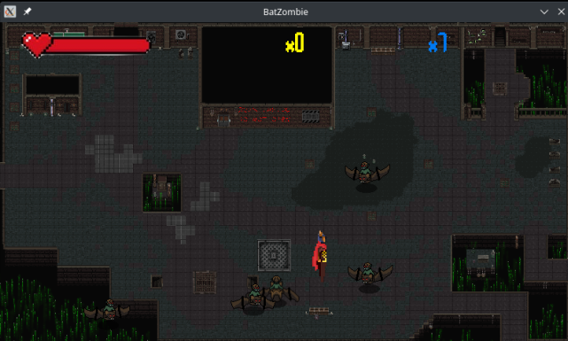

# IF669-Game
Projeto final da cadeira de Introdução à Programação.

## IDEA
A história é baseada na jornada de um viking, chamado Gusttavo dos Ponteiros, que caí num submundo caótico repleto de seres malignos, os _BatZombies_ e após aniquilar todos estes seres, o personagem cai em um Vórtex para enfrentar o seu último inimigo, o Peter ACM Griffin, sob uma nova pespectiva de mundo...

O jogo é subdividido em duas fases:

- I) Um jogo 2D, o mundo dos _BatZombies_

- II) Uma fase 3D, o confronto final!

